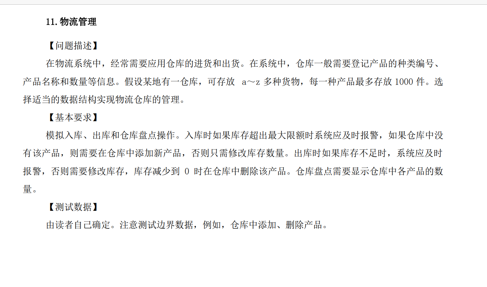

# 22Fall-OOP-Project1
第四、五周实验课作业
模板类实现《链表的链表》

链表的链表->多个仓库，每个仓库中有多个货物

`LinkList<LinkList<Express>>`

### 主要实现

1. 入库、出库、加减仓库 zlc
2. 盘点（就是统计，全局&当前库）、查找    lz,cth
3. 输入输出运算符重载、测试 jyt

种类编号，一种拥有唯一一个。在所有仓库里编号都一致。

### 统计：

全局库中，有几个库， 各个商品有多少（这个可以用当前库

当前（选定一个）库中，各个商品有多少（这个先写

### 查找：（找名字和找ID）

全局库中，某个商品有多少，各个地方各有多少（这个可以用当前库

当前库中，某个商品有多少（这个先写

### 

### 
